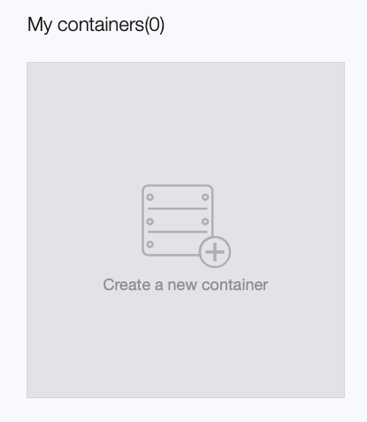
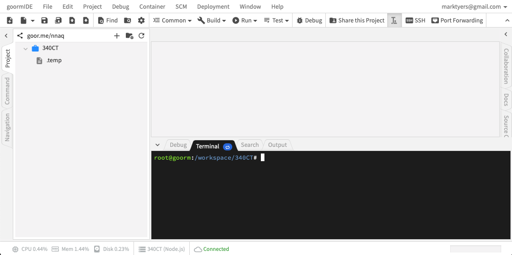
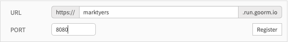
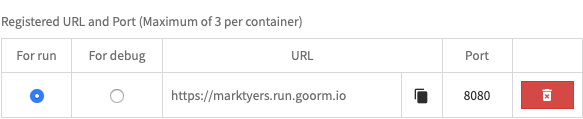

# The Goorm IDE

This is a good example of an online IDE. These enable you to do software development without needing to install anything on your computer. They are also ideal for use with a Chromebook. You need to sign up for an account on [their website](https://ide.goorm.io/), sign in and access the dashboard page. Click on the **Create a New Container** button.



You will be presented with a screen where you can name your project and choose a software stack:


You should see an IDE that displays the files down the left side with an editor in the main view and a terminal window below:



## 1 Cloning the Lab Content

The next step is to clone the repository containing the lab materials into the IDE. Start by opening the [GitHub page](https://github.coventry.ac.uk/340CT-1819SEPJAN/TEACHING-MATERIALS). Locate the **Clone or download** button, clicking this pops open a small window as shown. Copy the URL in this window to your clipboard.


Returning to the IDE, run the following command in the terminal:

```shell
git clone https://github.coventry.ac.uk/340CT-1819SEPJAN/TEACHING-MATERIALS.git labs
```

This creates a `labs/` directory containing all the files from the repository.

By default real-time linting is enabled however this currently uses an old linter and is not ECMA6 compatible. You should disable real-time linting from the **Project** menu.

## 2 Updating NodeJS

We can see the current version of NodeJS by running the `node -v` command. The latest version is 10.11.0 and so we need to upgrade this.

Start by installing the Node Version Manager tool:

```shell
curl -o- https://raw.githubusercontent.com/creationix/nvm/v0.33.11/install.sh | bash
```

Now click on the small blue oval on the terminal tab to reload the shell. There are lots of versions available, use the `nvm list-remote` command to see these. Install the latest using `nvm install 10.11.0` substituting the latest version number. To check the version installed use `node -v` again.

## 3 Running an Express Server

Use the terminal to navigate to the `exercises/01_setup/` directory and try running the `index.js` script:

```shell
$ cd exercises/01_setup/
$ node index.js
  Error: Cannot find module 'koa'
```

Notice you get an error, we need to install the missing module using the _Node Package Manager_ tool. We can then try to run the script again:

```shell
$ npm install koa
$ node index.js
  app listening on port 8080
```

Now we have the server up and running so the final task is to view the web page using the web browser.


This will open a window where you will need to register a new URL and port:



1. Use your **University Username** as the URL segment.
2. Make sure you specify port **8080** (this is the one used by your server).

You need to set this up as your **run** configuration as shown.



The final step is to open a new browser window and enter your chosen URL, you don't need to specify the port, this was done through port-forwarding:


If you make changes to the code or want to quit the IDE you will need to stop the server. To do this, select the terminal window and press ctrl+c.

## 4 Git Configuration

Before you can work with Git you need to update the repository configuration. Follow the instructions below:

1. Update your name (this must be the name as it appears on your ID badge) using `git config user.name 'Joe Bloggs'`.
2. Update your email (using your unversity email) `git config user.email 'bloggsj@uni.coventry.ac.uk'`
3. Update your commandline editor choice using `git config core.editor nano` (the editor must be installed!)
4. Cache your credential (username/password) for an hour using `git config credential.helper 'cache --timeout=3600'`
5. Update the path to your _git hooks_ directory using `git config core.hooksPath ./.githooks` (more on this in a later lab).

## 5 Local Setup

If you are planning on using your own laptop you will need to install some key pieces of software. Obviously its impossible to cover the installation process in detail for every operating system but there are plenty of guides online. You should install:

1. Visual Studio Code (Not Visual Studio!)
2. The latest version of NodeJS. For Linux follow the instructions to install nvm, for other platforms download and install the latest version from the [official site](https://nodejs.org/en/), make sure you install the **latest** and not the LTS version.
3. You also need to install Git if it is not already installed. Mac and Windows users can download the installer from the [official website](https://git-scm.com/book/en/v2/Getting-Started-Installing-Git).

Once everything is installed you can clone the module repository using the same command you used in the Goorm IDE lab (make sure you clone it to a sensible location).

Once the repository is cloned you should open VS Code and use the File > Open Folder option to select and open the folder containing the repository (On some systems you choose File > Open).

Once the web server is up and running you access the page by pointing the browser to `localhost:8080`.

## 6 Introducing Unit Testing

As we develop more complex web apps it becomes more and more difficult to fully test our app every time we change the code. By not testing everything at regular intervals there is an increasing chance that our new code could break the existing code in our system. Since regular testing is a chore, programmers have developed ways to automate this process.

In this section you will be given a sneak preview of how an automated test suite works. We will be using a testing framework developed by Facebook, called [Jest](https://jestjs.io) and will be using a second tool called [Supertest](https://github.com/visionmedia/supertest#readme) which allows us to interact with our code using http.

The process requires you to install both these packages and then run the `jest` command:

```shell
$ npm install jest supertest
$ ./node_modules/.bin/jest
  PASS  .test/index.test.js
    GET /
      ✓ the page should return a status code of "200 OK" (25ms)
      ✓ we should see the text "Hello World" displayed (3ms)

  Test Suites: 1 passed, 1 total
  Tests:       2 passed, 2 total
  Snapshots:   0 total
  Time:        1.478s
  Ran all test suites.
```

If you study the test output carefully you will notice that there is a test script `.test/index.test.js` which contains 2 tests in 1 test suite. Each test has a name and the ticks indicate that both tests have passed.

### 6.1 Watch Mode

It is possible (and desirable) to run the test suites every time you save any changes to your app. Testing tools such as Jest support a _watch mode_ that detects if files have changed and automatically runs the full test suite if this happens:

```shell
./node_modules/.bin/jest --watch
```

To exit watch mode press (ctrl+c).

### 6.1 Test Your Understanding

Make sure that you are running Jest in watch mode.

1. Modify the `index.js` script so that the web page displays your name.
2. The unit test suite will be triggered by you saving your changes. Read the output carefully.
3. Modify the test suite so that it is looking for the text `My First Tests`.
4. The unit test suit will be triggered again, note that one of the tests has still failed.
5. Modify the `index.js` file to make the test suite pass.
