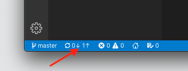

# Setup

In this worksheet you will learn how to configure your work environment using VS Code. You should start by installing **Visual Studio Code** (NOT VISUAL STUDIO!) from the [website](https://code.visualstudio.com), note that it might already be installed. If you are using a Coventry University computer and the software is not installed you can do this using AppsAnywhere.

If you are using Windows 10 you will also need to install [Git](https://git-scm.com/download/win), this may already be installed on a Coventry University computer.

## 1 Forking the Foundation Materials

You should start by logging in to the University GitHub server using your university username and password. Make sure you don't log into GitHub.com!

Next you should open the [web page](https://github.coventry.ac.uk/web/foundation) containing the foundation materials and click on the small Fork button in the top-right corner of the page


You will be asked to select where you want to place the forked repository, make sure you choose your own personal space (the one that is named using your username).


This will create an exact copy (clone) of the repository in your personal workspace. It should indicate where the original version was (see below).


## 2 Cloning the Lab Exercises

Locate the green **Clone or Download** button and click this. You will see the option to clone with HTTPS. Click on the copy icon as shown to copy the URL to the clipboard.


Launch the **terminal** app (Mac and Linux users) or Bash Shell (Windows 10 users). Now use this to navigate to the directory where you want to store the lab materials. You should use the following bash commands:

1. `ls` is used to see the contents of the current directory.
2. `pwd` prints the path to the current directory.
3. `cd` changes to the directory you specify, `cd ..` takes you to the parent directory.

When you are in the chosen location you need to clone the repository using the URL we copied earlier:

```shell
git clone xxx
```

Replacing xxx with the content of the clipboard.

This will create a directory called `foundation` which contains all the content from the repository.

Now you can launch Visual Studio Code and use the **File** menu to open this `foundation/` directory.

### 2.1 Additional Steps for Windows 10 Users

If you are using Windows 10 you will need to carry out some additional steps before starting the lab exercises:

2. Open the integrated terminal using the **Terminal** menu.
3. Type - Select Default Shell
4. Select Git Bash from the options
5. Click on the + icon in the terminal window.

This will open a new Git Bash shell in the project directory.

## 3 Pushing the Changes to GitHub

As you work through the lab activities two things are likely to happen:

1. You make changes to the code that you want to push to the forked copy of your repository.
2. You will need to pull any bug fixes from the original repository.

### 3.1 Configuring the Repository

Before you start interacting with the GitHub server you need to configure the local repository. Open the Bash Shell and run the following commands:

```shell
git config user.name 'John Doe'
git config user.email 'doej@coventry.ac.uk'
```

remember to replace the values with you own name and your university email (but without the uni part).

### 3.2 Pushing Changes

As you save your changes you will see a blue circle against the **Source Control** tab that indicates how many files have been changed, we need to get these changed files up to GitHub. Start by opening the tab, you will see a list of all the files you have changed.

1. Click on the + button to stage these changes.
2. Type in a commit message to explain what changes you have made.
3. Click in the tick button to commit the changes.


Now you should click on the **Sync** icon (shown below) to push the new commit up to your GitHub repository, this will also pull doen any commits that are on the GitHub server but that you don't have on your local computer. The first number is the number of commits it will pull from GitHub (down arrow) and the second the number of commits it will push from your local computer to GitHub (up arrow).



At this point you should be able to refresh your GitHub repository page to see the changes.

### 3.3 Pulling from Upstream

As changes are made to the master repository you will want to merge these into your forked repository. Before you can do this you will need to add a link to the upstream repository. Open a bash shell:

```bash
git remote add upstream https://github.coventry.ac.uk/web/foundation.git
git remote -v
```

Now, every time you have committed and pushed you changes you can pull the changes from the master repository:

```shell
git fetch upstream
git checkout master
git merge upstream/master
```

Don't worry if you don't understand what is happening, this will be explained in a future lab.

## 4 Installing NodeJS

Next we need to install and configure NodeJS. If you are using MacOS or Linux the first task is to install the Node Version Manager tool. You can find detailed [instructions](https://nodesource.com/blog/installing-node-js-tutorial-using-nvm-on-mac-os-x-and-ubuntu/).

Once installed you may need to restart your computer. Now check it was installed correctly:

```bash
$ command -v nvm
  nvm
```

Now we can install the latest version of NodeJS:

```bash
nvm install node
node -v
```

If you are running Windows 10 you need to [download the installer](https://nodejs.org/en/) for the **Current** version of NodeJS (12.10 at the time of writing).

## 5 Running a Web Server

Use the terminal to navigate to the `exercises/01_setup/` directory and try running the `index.js` script:

```shell
$ cd exercises/01_setup/
$ node index.js
  Error: Cannot find module 'koa'
```

Notice you get an error, we need to install the missing module using the _Node Package Manager_ tool. We can then try to run the script again:

```shell
$ npm install koa
$ node index.js
  app listening on port 8080
```

Now we have the server up and running so the final task is to view the web page using the web browser. Simply open the Chrome browser and navigate to localhost:8080 where you should see a message. If this works you are ready to start the lab exercises.
