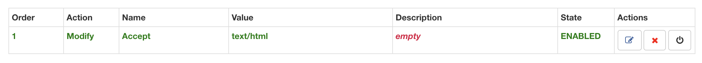

# The HTTP Protocol

In the lecture you learned about the HTTP protocol which is used to transfer information between web server and the web browser. Without this the World-Wide Web (WWW) would not exist. This lab will allow you to apply this knowledge and learn the details.

## Setup

You will need to use the Chrome web browser for these exercises and have installed the [ModHeader](https://goo.gl/YWWK3q) plugin.

Open the **Chrome Developer Tools** as shown below.


## 1 Request/Response

The HTTP protocol works on a request-response process, The client (typically the web browser) sends a request to the server which sends a response back to the client.

The request consists of three key parts:

1. The **URL** of the resource being requested.
2. The **HTTP Method** specifying the action to be taken.
3. A set of **Request Headers** to pass additional information.
4. Some methods (such as POST) also require a **Request Body**.

We will be working through some exercises that make use of all of these.

1. Start up the server script in the `exercises/02_http/` directory. Refer the the previous lab if you get stuck at this point.

NB: Before running the script you will have to install the js2xmlparser package. To do this, type the following in ssh terminal;
    $ npm install js2xmlparser

HINT:  use cd to change to the correct directory path - $cd TEACHING-MATERIALS/exercises/02_http and then run index.js ($node index.js)

2. Using the server URL (see previous lab), access the root url `/`. This is the same activity that you carried out in the first worksheet and you should see the string `hello world`.

HINT: Right-click on labs and select info from the dropdown. Then click on the url remembering to add :8080 to the end of it.

3. Locate the **Network** tab in the Chrome developer tools and in there you should see the resource sent in the HTTP response together with some data dealing with response times.
4. Click on the file name (as shown) to display the HTTP headers.


As you can see, the headers are displayed in a nice format. We need to see the _source_ (the raw data). Locate the **View Source** links as shown and click to toggle how the data is displayed.


You can now see the raw data sent in the _Request Headers_ and returned in the _Response Headers_.


In the **Request Headers** note that:

1. The first line specifies the HTTP method (GET) and the version of HTTP we are using (HTTP/1.1).
2. Next it specifies the host the request is being sent to.
3. Then there are multiple request headers. These are always key-value pairs. Lets look at a few of the more interesting ones:
    1. The `User-Agent` header sends information about the browser being used.
    2. The `Accepts` header tells the server what [MIME](https://goo.gl/W2SWtZ) data types our browser prefers.

In addition to the **Response Body** (the information in the web browser window), the server has returned a **Status Code** (in this case it is `200` meaning `OK`) plus a set of **Response Headers** that provide additional information.

1. The `Content-Length` header specifies the number of characters in the response (in this case 11).
2. The `Date` header is a string representing the date and time the response was sent.
3. The `ETag` header contains a hash of the contents and is used to see if the content has changed since the last request.

### 1.1 Test Your Knowledge

As part of the worksheets you will be given some exercises to carry out to make sure you fully understand the content covered.

1. Go to the [University website](http://www.coventry.ac.uk) and use the Chrome Developer Tools to examine the request and response headers.
    1. Are there any headers that were missing from the example above?
    2. [Look up](https://developer.mozilla.org/en-US/docs/Web/HTTP/Headers) the meaning of all the headers.

## 2 Using the POST Method

Now we have a good understanding of the request-response process used by the HTTP protocol and have learned about the headers we will extend this by examining the use of the HTTP POST method.

1. Start by accessing the list of names on the `/names` url Make sure you have the Chrome Developer Tools open on the Network tab.:
    1. Notice the browser displays an error message.
    2. If you look at the HTTP Status Code you will see it is `404 Not Found` which makes sense as there are no names in the list (yet)
2. Now access the form page on the `/form` URL. By default browsers use the GET method. 
3. Input your name and use the `submit` button to add this data to the website. Examine the request and response headers:
    1. Notice that the Request Method has changed to `POST`.
    2. Notice that the Response Code is `201 Created` to indicate that your data has been uploaded and stored.
    3. There is a section called **Form Data** which is the request body and contains the data you submitted using the form. Use the _View Source_ link to display the raw data. This is how your data is sent to the server.
4. Use the back button to return to the form and use this to add the names of everyone else on your table.
5. Access the `/names` url which should now respond with the HTTP Status Code `200 OK` and display your names in an HTML table.

## 3 Meta-Data

The path in the Uniform Resource Locator (URL) represents a _resource_ on the server however sometimes you need to pass _metadata_ to tell the server what you want it to do with this resource. There are two ways to pass metadata in an HTTP request, query strings and request headers. They differ in that anything in the URL is part of a book mark whilst the request headers are not. You need to decide whether this is important before deciding which to use.

### 3.1 Query Strings

Query strings are additional pieces of information attached to the URL and because of this it will be included in the bookmark. They are added as key-value pairs.

1. Still on the `/names` URL, add a `search` querystring, your URL will look like this: `/names?search=xxx` where the `xxx` represents the string fragment you are searching for.
    1. Try searching for a string fragment you know exists, what is the status code?
    2. Now search for a non-existent string fragment, what is the status code and why?
2. Add the page as a browser bookmark.
3. Retrieve the bookmark, notice that it includes the search query.

### 3.2 Request Headers

You have already seen the request headers that are sent automatically by the web browser however you can add your own to this. Let's start by replicating the search functionality by passing the search criteria as a request header.

1. Remove the query parameter from the URL so that all the names are displayed.
2. Open the **Modify Headers** plugin and add a custom header called `search` and sets its value to something you want to search for (see screenshot below).
3. Close the Modify Headers window and refresh the browser window, you should see the search is applied.
4. Bookmark this page.
5. Retrieve the bookmark, notice that the search is ignored.


You can also modify the standard request headers. In this example we will change the `Accept` header which defines the prefered format of the response data. The data formats are defined as [MIME types](https://developer.mozilla.org/en-US/docs/Web/HTTP/Basics_of_HTTP/MIME_types) The default settings look something like:

```
text/html,application/xhtml+xml,application/xml;q=0.9,image/webp,image/apng,*/*;q=0.8
```

This specified that the browser would prefer data in HTML/XML format (0.9 weighting) but will accept certain image formats and everything else. We will be changing this to request our data in specific formats.

1. Still on the `/names` URL, modify the request headers by removing and search terms.
2. Add a custom `Accept` header which will override the default and sets its value to `text/html` (see the screenshot below). If you refresh the browser you will see that the data is still displayed in an HTML table (because this format has been provided by the server).
3. Now try the following MIME types:
    1. `application/json`
    2. `application/xml`
    3. `text/csv`
4. Notice how in each case, the server is sending the _same data_ but in a different format.
5. Finally lets try an unsupported MIME format, `text/plain`.
    1. Notice we get an error.
    2. We get an HTTP Status Code of `406 Not Acceptable`.



