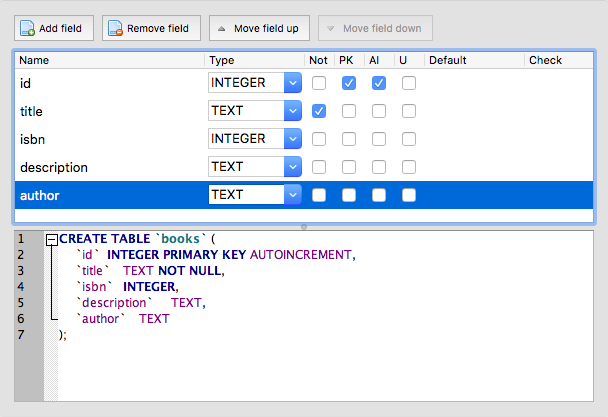

# Data Persistence

By this stage you are familiar with how to use NodeJS and the Express package to build a web server that can listen for http requests on a specific port and, based on the _route_ in the URL send data back to the browser. In this lab we will dive into how we can store data in a relational database and retrieve it in response to an http request.

We will be using the [SQLite database](https://www.sqlite.org/index.html) which stores a database in a single binary file much like MS Access. The main benefit of this is that you don't need to install a DB on your server but for a production environment you will find it is not secure.

The lab is split into two sections:

1. In the first section you will be learning about the tools you can use to build and query the database.
2. In the second section you will learn how to interact with the database using the [SQLite3 package](https://www.npmjs.com/package/sqlite3).

## 1 Building SQLite Databases

To interact with an SQLite database file you will need to install software on your computer. If you are using the shell (for example working on Codeanywhere) you need to install the SQLite Shell Tools and this is covered in the first section below. If you are using a graphical environment (gui) such as MacOS, Ubuntu Desktop or Windows 10 you can install a graphical tool which makes manipulating the database much easier. You should be familiar with both approaches.

### 1.1 Using the Shell Tools

Start by installing the tools on your computer:

1. On MacOS, install the [Brew Package Manager](https://brew.sh/) then `$ brew install sqlite`.
2. On Ubuntu (including CodeAnywhere) it should be installed using the standard package manager:
		1. `$ sudo apt-get update`
		2. `$ sudo apt-get install sqlite3 libsqlite3-dev`
3. It a bit of a pain to install on Windows 10 but there is a good [YouTube video](https://youtu.be/zOJWL3oXDO8) that covers the process.

If you use the terminal/command prompt to navigate to the `exercises/13_website/bookshop/` directory you will find a prebuilt database called `bookshop.db`. To open a database you use the `sqlite3 bookshop.db` command. Note: if the file you specify does not exist, a new database will be created. Open the `bookshop.db` database.

Notice that the prompt changes to `sqlite>`, this means you are interacting with the `sqlite3` program. There are a number of special [commands](https://www.sqlite.org/cli.html) that include standard SQL statements as well as special sqlite commands (these start with a period/dot and are sometimes called _dotcommands_. Try the following commands (note: the up arrow recalls previous commands):

```sql
sqlite> .tables
sqlite> .schema books
sqlite> SELECT title, isbn FROM books;
sqlite> .headers on
sqlite> SELECT title, isbn FROM books;
sqlite> .mode column
sqlite> SELECT title, isbn FROM books;
sqlite> .exit
```

#### 1.1.1 Executing Complex SQL Commands

The sqlite shell works well for simple SQL statements but it is difficult to enter more complex ones. A better solution is to create a .sql file containing the commands you want to run and then importing it. There is a books.sql file in the same directory as the database. If you open this you will see an SQL INSERT statement that will add a new book to the database:

```sql
$ sqlite3 bookshop.db
sqlite> .read books.sql
sqlite> .headers on
sqlite> .mode column
sqlite> SELECT title, isbn FROM books;
sqlite> SELECT count(id) AS books FROM books;
sqlite> .exit
```

#### 1.1.2 Test Your Understanding

1. Edit the `books.sql` file so it contains 3 INSERT statements to insert an additional 2 books into the database.
2. Run this SQL on your `bookshop.db` database to insert the two book records.
3. Check that there are now 14 books in the database.

### 1.2 Using a Graphical Tool

As you have seen it is possible to work with an SQLite database using the CLI however it is not simple and straightforward, especially when inserting complex records. In this section we will be learning how to use a graphical tool called [DB Browser for SQLite](https://sqlitebrowser.org) which runs on MacOS, Linux and Windows. Note: since Codeanywhere does not suport a traditional X11 Windows GUI you won't be able to install it.

1. On MacOS and Windows 10 you can download the installer from the [main website](https://sqlitebrowser.org).
2. On Ubuntu Linux you need to [add an additional repository and install from there](https://linuxhint.com/install-sqlite-browser-ubuntu/):
		1. `sudo add-apt-repository ppa:linuxgndu/sqlitebrowser-testing`
		2. `sudo apt-get update`
		3. `sudo apt-get install sqlitebrowser`

Install and open the software then use the **Open Database** button in the toolbar to open the `bookshop.db` database.

#### 1.2.1 Modifying the Schema

Our first task is to add an author field to the database. Make sure the **Database Structure** tab is selected then right-click on the table name and choose **Modify Table**.


Use the **Add Field** button to add the `author` field which should have a type of `text`. 



Notice that it builds the correct SQL statement underneath. This is useful to learn how to use the SQL language. When you are done, click on the **OK** button.

#### 1.2.2 Browing and Editing the Data

Now we have modified the database schema we need to complete the task by adding the authors for the books in the table. You can find the list of authors in the `books.csv` file. Note: you have added two more books to the database so you will need to search for the authors data for these.

Open the **Browse Data** tab. Notice that there are two panes of information.

1. The left pane displays the records and fields currently in the selected table. You will have three additional records at this stage).
2. The right pane is for editing the currently selected database cell. if you make changes to a cell you should use the **Apply** button to save them.


Using the data in the `books.csv` file, add the authors to each of your book records.

#### 1.2.3 Test Your Understanding

1. Add two more fields to the database to store the _publisher_ and the _year_ the book was published. Make sure you choose the most appropriate data type for each.
2. Use the data in the `books.csv` file to insert the correct data. You will need to find this data for the three additional books you have added to the table.

## 2 Retrieving Data Using NodeJS and Express

Now you have built a database you need to learn how to retrieve its data and display it in the web browser. In this section we will be covering several scenarios:

1. Retrieving a small number of fields from multiple records. This might be all the records in the database or you might be filtering this based on a search term.
2. Retrieving all the fields from a single record based on its primary key.
3. Deleting a record based on its primary key.

In a later lab we will cover how to use html forms to update database records.

We will be using the  nodejs [`sqlite3` package](https://www.npmjs.com/package/sqlite3) to connect to the database. Open the `index.js` script, notice that we import the module at the top of the script (line 10) and then use this to create a new database object `db` on line 12. The callback is used to either notify us that we are connected to the database or that an error ocurred whilst attempting this.

### 2.1 Retrieving Multiple Records

After installing the necessary packages start the server, you should see a message to confirm you are connected to the sqlite database. What is displayed in the browser when you access the root url `/`?

Study the `index.js` script carefully:

1. We define our sql query as a string on line 18 and store this in a constant which we log to the terminal (can you see where this is printed)?
2. We then use the `all()` function that is part of the database `db` object. This takes two parameters:
    1. The sql query we defined earlier on line 18.
    2. A callback function that runs after the query has completed (or an error has occurred).
3. The callback function has two parameters:
    1. The first parameter contains the error object (or `NULL`) if there is not error. This is a common pattern shared by _all_ callback functions.
    2. The second parameter contains the data returned by the database. Since the `all()` function returns multiple records this data object will always be a JavaScript `Array`.
4. Next (starting on line 23) we use the [`for...of` statement](https://developer.mozilla.org/en-US/docs/Web/JavaScript/Reference/Statements/for...of) which iterates (loops) over arrays.
    1. One each iteration, a different object will be assigned to the `book` variable.
    2. The objects assigned to the `book` variable are the objects in the array.
    3. The object contains a property for each field returned by the sql query, in this case it contains both an `id` and a `title` property.
    4. The `res` (response) object has a `write()` function that sends text to the browser.
    5. At the end of the loop on line 26 we use the `end()` function to tell the browser we have finished sending data.

#### 2.1.1 Test Your Understanding

1. Modify the script to display the record id before each title.
2. Modify the script to display the **isbn** numbers to the right of the title.
3. Modify the script to move the isbn number to below the title line but indented (the tab character is `\t`).

### 2.2 Implementing a Search Feature

Now we have a way to display all the records we will now implement a way for users to search the database. Restart the server and access the `/books?q=JavaScript` route. Notice we have added a querystring that includes our search. You will see that only books that include `JavaScript` in the title are included.

The logic here is that we want to access the `/books` resource but want to modify the results. The querystring is not part of the route but is used to pass additional information. Study the script carefully:

1. On line 31 we extract the value passed in the `q` key in the querystring and store it in the `searchString` variable. This is then logged to the terminal. Check this to make sure it is displayed.
2. On line 33 we use this variable to build the correct sql statement which is logged to the terminal. Can you see this in the terminal window?
3. The rest of the script is the same as the previous example.

#### 2.2.1 Test Your Understanding

1. Try searching for `javascript`, how many results are returned? Use the [`String.toLowerCase()` function](https://developer.mozilla.org/en-US/docs/Web/JavaScript/Reference/Global_Objects/String/toLowerCase) to make the search case-insensitive.
2. If the querystring is missing you would expect **all** the records to be returned. Use an [`if...else` statement](https://developer.mozilla.org/en-US/docs/Web/JavaScript/Reference/Statements/if...else) to check to see if the querystring is present and select the appropriate sql statement.
3. Check for a second `order` querystring key. If it is present, modify the sql to order the results by the supplied value if this is a valid field. For example `/books?order=title` would order the results by their title. You should use the [`ORDER BY` clause](http://www.sqlitetutorial.net/sqlite-order-by/).
4. Check that your script can handle both querystring keys at the same time, for example `/books?q=java&order=title`.
5. Add a `count` key to tell the script how many records to return. You should use the [`LIMIT` clause](http://www.sqlitetutorial.net/sqlite-limit/).

### 2.3 Displaying a Complete Record

In the previous two sections you have been working with lists of records in the form of an `Array`. Now we will learn about how to select and display a single record. Restart the server and access the `/details/1` route. Study the script:

1. The _route_ on line 45 has two segments:
	1. The string `details`.
	2. A segment called `:id`
2. On line 46 we extract the string passed in the second segment (in our example `1`) and store this in the `bookID` variable that is logged to the terminal. Check this is the case.
3. On line 48 this value is used to build an SQL statement that uses the [`WHERE` clause](http://www.sqlitetutorial.net/sqlite-where) to match the value to a database record. This is then logged to the terminal.
4. We then use the `get()` function that is part of the database `db` object. This takes two parameters:
    1. The sql query we defined earlier on line 48.
    2. A callback function that runs after the query has completed (or an error has occurred).
5. The callback function has two parameters:
    1. The first parameter, as before, contains the error object (or `NULL`) if there is not error.
    2. The second parameter contains the data returned by the database. Unline the `all()` function we used earlier, the `get()` function returns only the first record found (even if there are more than one). In this case, the `data` object will be a JavaScript object (not an Array). The object will contain a key for each field selected.
6. The `res.write()` function is used to send data to the browser.
7. Finally the `res.end()` tells the browser there is no more data.

#### 2.3.1 Test Your Understanding

1. Check the browser displays a different book if you change the second url segment, for example to `/details/2`.
2. Display _all_ the fields for each book.
3. Display a suitable message if the record requested does not exist.
