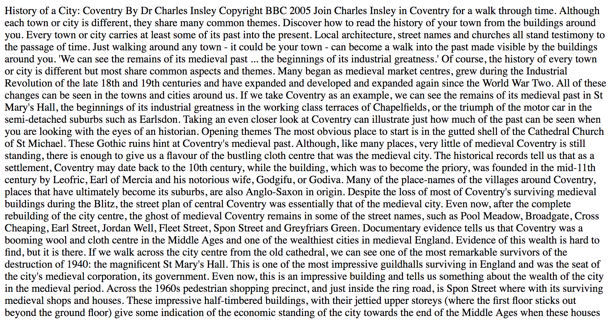

# Learning HTML5

In this worksheet you will be learning about the markup language HTML which is currently in version 5.

## 1 Syntax

1. Start by opening the `exercises/03_html/01_syntax/` directory and locate the `coventry.html` file. If you open it you will notice that, whist the text content is all there it lacks all the html markup.
2. Open the `index.js` file and take a look at the code structure:
    1. Lines 3-4 import the express package and create an instance called `app`.
    2. Next the port number is stored in a constant. You should always handle numbers by assigning to constants to make their purpose clear.
    3. Next, on lines 9-11 we define a _route_. This has two parameters:
        1. The path to match. In this case, the `/` represents the base url with no additional segments.
        2. The function to run if this route is accessed. In this case it loads the contents of the `coventry.html` file and sends it back to the web browser.
    4. Finally we tell express to listen on the specified port. There are two parameters:
        1. The port.
        2. A function to run as soon as the server is ready to receive requests.
3. Now open the SSH Terminal and navigate to the directory, install the `express` package and run the `index.js` file.
4. Finally you need to open a browser tab and navigate to the base URL on the correct port. You will see the following:

As you can see, all the newlines have been replaced by spaces.

Your job is to add html formatting to the text to make it readable. You should first of all add the basic HTML5 tags and then format the text using:

- Heading tags (levels 1-3).
- Paragraph tags.
- Horizontal rules.
- All date ordinals should use superscript.

As you work, save the html file and refresh the browser, you don't need to restart the `index.js` script. Use the [html validator](https://validator.w3.org/#validate_by_input) to check your work on a regular basis.

## 2 Hypermedia

Next we will learn how to work with _hypermedia_ to link multiple documents together. Locate the `exercises/03_html/02_hypermedia/` directory. This contains a website that comprises:

- Multiple pages
    - links between pages
    - links to anchors on the same web page
- Images embedded in web pages

Each page in the website needs to be on a different _route_. Open the `index.js` file and examine the code.

1. Notice that there are two routes defined:
    1. The base URL loads the contents of the `index.html` file.
    2. The `/paradoxes` route loads the contents of the `paradoxes.html` file which is in the `html/` directory.

- lists
    - unordered
    - ordered
    - description
- links
    - routes
    - images
    - hyperlinks
    - attributes
- media elements
    - audio
    - video
    - youtube

## 3 Tables

- tables
    - tags
- semantic html elements (header, footer, section, article, aside)

## 4 Forms

- forms
    - action
    - form tags
      - input types
      - validation
        - buttons
        - layout
    - labelling
    - grouping
