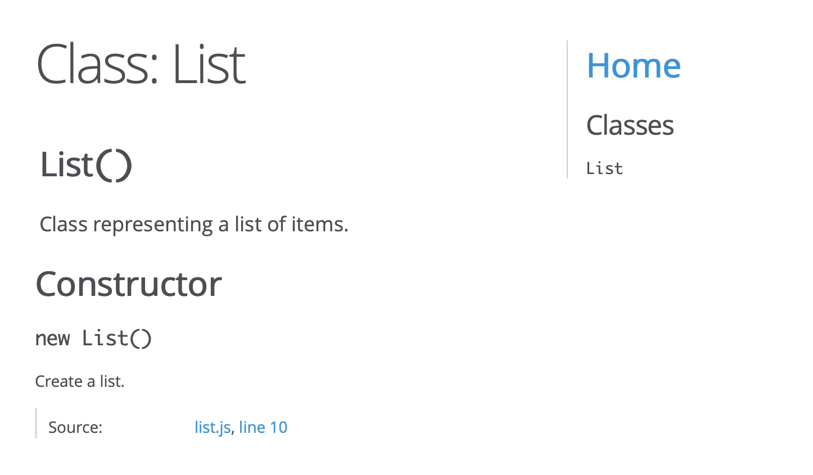

# Code Quality

In this worksheet you will be applying a range of techniques to improve the quality of your code. Specifically we will cover:

1. How to split your code into separate files (modules).
2. How to enforce good coding practices using a linter.
3. Generating documentation for your code using special comment blocks.
4. Improving the readability of your async code blocks using promises and async functions.

Before you start you need to pull any _upstream changes_. Detailed instructions can be found in the **Setup** lab.

## 1 The Package Manifest

Up until now you have needed to install each NodeJS package separately however most projects you will see from now onwards include a **package manifest** whick contains the project metadata. In a NodeJS project this file is named `package.json`. Locate the `06_code_quality/todo/` directory and open the `package.json` file it contains. This is a JSON file that contains a number of properties that are used by the application.

Locate the `dependencies` property, notice that this lists a number of packages that are needed by the application. Rather than install depndencies one by one we can tell the package manager to install all the packages listed here.

```bash
$ npm install
```

Notice that this has installed all these listed packages. The manifest also specifies which version of each package are installed. If you want to install additional packages you can get these added to the `package.json` file automatically. For example if we want to install the `http-status-codes` package this should be done like this:

```bash
$ npm install --save http-status-codes
```

## 2 Modularisation

Next you will need to do is to split your code up to make it easier to understand. Take a look at the `06_code_quality/todo/` project. If you run this you will see that it is a simple shopping list app where you can add multiple items and quantities. Currently all the functionality is contained in the `index.js` file. Locate the `modules/list.js` file. This declares a new Object Prototype called `List` which includes all the necessary functionality for the app. At the moment this is not being used by the app.

Lets examine this module:

1. We define an object prototype called `List`.
2. This contains an object prototype definition using the modern `class` syntax. If you are not familiar with the concept refer back to the **JavaScript** lab sheet.
3. On lines 43-45 we create an object containing all the functionality we want to export and pass this to the `module.exports` object. This uses the new **Object Property Value Shorthand** syntax (see below).

The object property value shorthand notation is useful if the keys have the same name as the variables passed-in as properties. For example the code in the module could be written as:

```javascript
module.exports = {
    List: List
}
```

Now look at the top of the `index.js` file. Lines 18-19 import the module and create an instance of the List prototype. Notice that we are only importing the `List` prototype from the module. This `List` object prototype is then used to create a new object. This object is called `list` and provides access to all the functionality defined in the object prototype. Foe example to add an item we can use:

```javascript
list.add('bread', 42)
```

This will call the `add()` function that is part of our `todo` object prototype. If you try and run this you will find that there is no functionality at all!

### 2.1 Test Your Understanding

The custom object prototype defined in the `list.js` module already contains the functionality needed by your app. 

1. Modify the callback function in the `router.post('/')` function, inserting a call to `list.add()`, passing the item name and quantity as parameters.
2. Now modify the callback function in the `router.get('/')` function, replacing the empty array declaration with a call to the `list.getAll()` function.
3. Test the base functionality so far, you should be able to add items to the list.
4. Finally implement the delete functionality.

## 3 Linting

When using a language as flexible as JavaScript which contains so many legal (but terrible) features, it is important to use a linter. This will check your code against a set of rules. These ensure:

1. You are not using what are considered bad language features.
2. You are implementing optional syntax (such as indentation and semicolons) in a consistent manner.
3. You are writing code that is easy to maintain.

Locate the `06_code_quality/todo/` directory and study the `index.js` file. You should be feeling pretty comfortable that you are looking at clean, consistent and maintainable code, lets see how good your code really is!

You should start by ensuring you have installed `eslint` which is considered the industry standard and that you have a copy of the approved configuration file `.eslintrc.json` in the root directory of your project.

Now navigate to the `06_code_quality/` directory using terminal and run the linter on the `index.js` code in the `todo/` directory:

```shell
$ node_modules/.bin/eslint todo/index.js
```

You will see a list of issues that the linter has flagged in your code. Notice that some of these are flagged as errors (serious) and some as warnings (recommendations). Each message includes:

1. The line and comumn number where the error was found.
2. A description of the error.
3. The rule that is being broken.

The latter can be used to quickly look up the rules in the [comprehensive documentation](https://eslint.org/docs/rules/).

Instead of running separate checks on every file, we can specify the directory we want to check and it will automatically scan all the subdirectories. For example to scan all the files in the `modules/` directory we could run:

```shell
$ node_modules/.bin/eslint todo/
```

### 3.1 Test Your Understanding

1. Locate and fix all the errors and warnings in the `index.js`.
2. Install `eslint` globally and then install the [eslint extension](https://github.com/Microsoft/vscode-eslint). After restarting your editor you should see any errors and warnings flagged in the editor.
3. Use the `eslint` plugin to locate and fix all the errors in the `modules/list.js` file.

## 4 Documentation

In this third and last topic we will be using the [JSDoc](http://usejsdoc.org) tool to build a detailed code documentation website by extracting special comments inserted into our source code.

The default set of documentation tools provided in JSDoc are not suitable for documenting Koa routes and so we will be using a plugin called [jsdoc-route-plugin](https://www.npmjs.com/package/jsdoc-route-plugin). This should have been installed by the package manifest however you should check that you are using the current version of the `package.json` file and update if needed, rerunning the `npm install` command to ensure all packages are installed. You should also check that you have the latest version of the `jsdoc.conf` configuration file.

Now everything is installed we can run the `jsdoc` tool on the project in the `todo/` directory which will generate our documentation. The `-d` destination flag tells the tool where to save the documentation.

```shell
$ ./node_modules/.bin/jsdoc -d ./docs/jsdoc/  modules/*
```

If you run this command you should see a new directory called `docs/` which will contain a `jsdoc/` directory. Inside this you will see some website files, opening the `index.html` file in your browser you should see the documentation pages for your website!



### 4.1 Test Your Understanding

You will probably have noticed that only a couple of the functions include complete JSDoc comments and so the documentation website is incomplete. Your task is to use the existing comments for guidance and complete the task of documenting your code. You will find the [JSDoc](http://usejsdoc.org) and [jsdoc-route-plugin](https://www.npmjs.com/package/jsdoc-route-plugin) documentation helpful.

## 5 Improved Async Code

Since NodeJS has a single thread that handles all incoming requests it is vital that we push long-running tasks into their own threads, typically through the use of _callback functions_. In this section of the lab you will learn about the limitations of callbacks and explore more powerful ways to handle multi-threading.

## 5.1 Nested Callbacks

Because the code to be run after a callback is run needs to be _inside_ the callback code it is very challenging to build a script that contains several long-running tasks you get into a situation where you nest callbacks inside callbacks (inside callbacks) which makes the code very difficult to write, debug and read and means its very difficult to split into separate functions, a situation commonly known as **Callback Hell**.

Open the file `nestedCallbacks.js` which asks for a _base_ currency code then prints out all the exchange rates against other currencies. Notice that there are four functions defined, three of which include a callback. Our script is designed to capture user input using `stdin` (needing a callback), identify whether a currency code is valid (requiring a second callback) and then getting the currency conversion rates for the specified currency (requiring a third callback).

1. The script starts be calling the `read.question()` function (line 13) which takes a callback function as its second parameter.
2. We want the first `request()` function (line 18) to be run after the initial `read.question()` function has completed.
    1. To do this it needs to be called from inside the `read.question()` callback function.
3. The second `request()` function should run after the first one has completed and the data has been processed.
    1. To do this it needs to be called from inside the callback function of the first `request()` call.
4. The final step is to call the `read.question()` function again (line 38)) which should be run once the second request has completed.
    1. Therefore this needs to be in the callback function from the second `request()` function.

As you can see, each step has to be nested inside the previous step's callback, creating an ever increasing level of nested code sometime referred to as [Callback Hell](http://callbackhell.com/) or the [Pyramid of Doom](https://en.wikipedia.org/wiki/Pyramid_of_doom_(programming)).


Callbacks are the simplest possible mechanism for asynchronous code in JavaScript. Unfortunately, raw callbacks sacrifice the control flow, exception handling, and function semantics familiar from synchronous code.

### 5.2 Test Your Knowledge

The callbacks are already nested 4 deep. You are now going to add some additional functionality and, in doing this, are going to have to make use of additional nested callbacks!

1. The deepest callback is a prompt asking the user for the currency they want to convert into. Add the logic to retrieve the correct exchange rate from the data returned from the previous API call.
2. Instead of printing the exchange rate, ask for the amount to be converted and them return the equivalent in the chosen currency
3. The `currencies.json` file contains a map between the currency code and the country name. Load this file into the script using the [`fs`](https://nodejs.org/api/fs.html) module, convert to a JavaScript object using the [`JSON`](https://developer.mozilla.org/en-US/docs/Web/JavaScript/Reference/Global_Objects/JSON) object and use it to display the full name of the chosen currency. Below is some code to get you started.

You will need to import the `fs` module and use the `fs.readFile()` function which takes a callback!

```javascript
fs.readFile('currencies.json', 'utf8', (err, contents) => {
    if(err) console.log('you need to handle this properly')
    console.log(contents)
})
```

Even though the script is still simple you are probably already getting in a tangle! Imagine a more complex script with conditions, it would quickly get out of hand and become practically impossible to debug.

Thankfully there are a number of advance features in NodeJS that are designed to flatten out these callbacks and to treat asynchronous code in a more _synchronous_ manner. These care called _Generators_, _Promises_ and _Async Functions_ and are described below. Even though you don't technically _need_ to know these, its worth learning them to keep your code manageable.

## 6 Promises

_A promise is an object that proxies for the return value thrown by a function that has to do some asynchronous processing (Kris Kowal)._

A promise represents the result of an asynchronous operation. As such it can be in one of three possible states:

1. pending - the initial state of a promise.
2. fulfilled - the asynchronous operation was successful.
3. rejected - the asynchronous operation failed.

### 6.1 Creating a Promise

Promises are created using the `new` keyword. This function is called immediately with two arguments. The first argument resolves the promise and the second one rejects it. Once the appropriate argument is called the promise state changes.
```javascript
const url = 'https://api.exchangeratesapi.io/latest?base=GBP'
const getData = url => new Promise( (resolve, reject) => {
  request(url, (err, res, body) => {
    if (err) reject(new Error('invalid API call'))
    resolve(body)
  })
})
```
This example creates a `Promise` that wraps a standard callback used to handle an API call. Notice that there are two possible cases handled here.

1. If the API call throws an error we set the promise state to _rejected_.
2. If the API call succeeds we set the promise state to _fulfilled_.

As you can see it it simple to wrap any async callbacks in promises but how are these called?

### 6.2 Consuming a Promise

To use promises we need a mechanism that gets triggered as soon as a promise changes state. A promise includes a `then()` method which gets called if the state changes to _fulfilled_ and a `catch()` method that gets called if the state changes to _rejected_. 
```javascript
const aPromise = getData('https://api.exchangeratesapi.io/latest?base=GBP')

aPromise.then( data => console.log(data))

aPromise.catch( err => console.error(`error: ${err.message}`) )
```
In this example we create a _new Promise_ and store it in a variable. It get executed _immediately_. The second line calls its `then()` method which will get executed if the promise state becomes _fulfilled_ (the API call is successful). The parameter will be assigned the value passed when the `resolve()` function is called in the promise, in this case it will contain the JSON data returned by the API call.

If the state of the promise changes to _rejected_, the `catch()` method is called. The parameter will be set to the value passed to the `reject()` function inside the promise. In this example it will contain an `Error` object.

This code can be written in a more concise way by _chaining_ the promise methods.
```javascript
getData('https://api.exchangeratesapi.io/latest?base=GBP')
  .then( data => console.log(data))
  .catch( err => console.error(`error: ${err.message}`))
```
Because the Promise is executed immediately we don't need to store it in a variable. The `.then()` and `.catch()` methods are simply chained onto the promise. This form is much more compact and allows us to chain multiple promises together to solve more complex tasks.

### 6.3 Chaining Promises

The real power of promises comes from their ability to be _chained_. This allows the results from a promise to be passed to another promise. All you need to do is pass another promise to the `next()` method.
```javascript
const getData = url => new Promise( (resolve, reject) => {
  request(url, (err, res, body) => {
    if (err) reject(new Error('invalid API call'))
    resolve(body)
  })
})

const printObject = data => new Promise( resolve => {
  const indent = 2
  data = JSON.parse(data)
  const str = JSON.stringify(data, null, indent)
  console.log(str)
  resolve()
})

const exit = () => new Promise( () => {
  process.exit()
})

getData('https://api.exchangeratesapi.io/latest?base=GBP')
  .then( data => printObject(data))
  .then( () => exit())
  .catch(err => console.error(`error: ${err.message}`))
  .then( () => exit())
```
Notice that we pass the `printObject` promise to the `then()` method. The data passed back from the `getData` promise is passed to the `printObject` promise.

Because we can chain `then()` and `catch()` methods in any order we can add additional steps after the error has been handled. In the example above we want to exit the script whether or not an error has occurred.

Despite the code in the `printObject` promise being _synchronous_ it is better to wrap this in a promise object to allow the steps to be chained. 

If a promise only takes a single parameter and this matches the data passed back when the previous promise _fulfills_ there is a more concise way to write this.

```javascript
getData('https://api.exchangeratesapi.io/latest?base=GBP')
  .then(printObject)
  .then(exit)
  .catch(err => console.error(`error: ${err.message}`))
  .then(exit)
```


There are some situations where you can't simply pass the output from one promise to the input of the next one. Sometimes you need to store data for use further down the promise chain. This can be achieved by storing the data in the `this` object.

```javascript
getData('https://api.exchangeratesapi.io/latest?base=GBP')
  .then( data => this.jsonData = data)
  .then( () => printObject(this.jsonData))
  .then(exit)
  .catch(err => console.error(`error: ${err.message}`))
  .then(exit)
```

In the example above we store the data returned from the `getData` promise in the `this` object. This is then used when we call the `printObject` promise.

### 6.4 Test Your Knowledge

Run the `promises.js` script. Its functionality should be familiar to the `currency.js` script you worked with in chapter 3.

Study the code carefully. Notice that it defines 5 promises and chains them together. You are going to extend the functionality by defining some additional promises and adding them to the promise chain.

1. Modify the script to ask for the currency to convert to and display only the one conversion rate.
2. Instead of printing the exchange rate, ask for the amount to be converted and them return the equivalent in the chosen currency.
3. The `currencies.json` file contains a map between the currency code and the country name. Load this file into the script using the [`fs`](https://nodejs.org/api/fs.html) module, convert to a JavaScript object using the [`JSON`](https://developer.mozilla.org/en-US/docs/Web/JavaScript/Reference/Global_Objects/JSON) object and use it to display the full name of the chosen currency.

### 6.5 Executing Code Concurrently

In the async examples we have seen so far, each async function needs to complete before the next async call is run. The diagram below shows how this looks.
```
         1      2      3        
      ───⬤─────⬤─────⬤
```
The program flow is.

1. The first async call `getData` is executed.
2. Once this has completed, `printObject` is executed.
3. Only when this has completed will the `exit` step execute.

There are many situations where two steps can run at the _same time_. This would be impossible to build using standard callbacks but this can be written using promises.

The first stage is to create an array of promises. Typically this is done by looping through an array of data and using this to return an array of promises.
```javascript
const dataArray = ['USD', 'EUR']
const promiseArray = []
dataArray.forEach( curr => {
	promiseArray.push(new Promise( (resolve, reject) => {
		const url = `https://api.exchangeratesapi.io/latest?base=GBP&symbols=${curr}`
		request.get(url, (err, res, body) => {
			if (err) reject(new Error(`could not get conversion rate for ${curr}`))
			resolve(body)
		})
	}))
})
```
In the example above we loop through the `dataArray`, creating a new promise object that we push onto our `promiseArray`.

 Once we have an array of promises there are two possible scenarios.

1. We want _all_ the promises in the array to be fulfilled before continuing the promise chain.
2. We want _one_ of the promises to be fulfilled but we don't care which one.

#### 6.5.1 Promises All

In the first scenario we want _all_ the promises to be fulfilled before continuing and for this we use the `Promises.all()` method.

```javascript
Promise.all(itemPromises)
  .then( results => results.forEach( item => console.log(item)))
  .catch( err => console.log(`error: ${err.message}`))
```
When the `Promise.all()` method fulfills it returns an array of results. In the example above we loop through these and print each to the terminal.

#### 6.5.2 Promises Race

The alternative is that once one of the promises in the array has fulfilled we want to take its returned value and continue the promise chain. In this scenario we use `Promise.race()`.
```javascript
Promise.race(promiseArray)
	.then( result => console.log(result))
	.catch( err => console.log(`error: ${err.message}`))
```
As you can see, only a single value is returned by `Promise.race()`. In the example above you won't be able to predict which conversion rate will be returned but you will only get the one. A good application of this would be if you can get your data from multiple APIs but you don't know which ones are working.

## 7 Async Functions

In the previous sections we have covered the use of _generators_ which allow the use of synchronous-style code to handle async code but the syntax is far from intuitive.

We then looked at the use of _promises_ which allows you to wrap async code as a series of promises which can be chained together and implements exception handling. The price we pay for this is non-intuitive syntax which can become over complex. Async functions combine the benefits of promises with a clean synchronous-style syntax, avoiding the complex syntax used in promise chains. They are designed to simplify the behaviour of using promises in a synchronous manner.

Whenever we execute a function there is some implicit behaviour we expect. One behaviour is that, once invoked, a function will run until it gets to the end. Async functions break this behaviour, they can pause at any point and resume at a later point on the script. This enables us to write _asynchronous_ code that looks and feels _synchronous_, it can even use standard `try-catch` execption handling.

1. We can chain promises together in a cleaner way with full exception handling.
2. We can substitute a _promise_ with an _async function_ without needing to change any other part of the script.

### 7.1 Simplifying Promise Chains

Here is a simple example.

```javascript
const getData = url => new Promise( (resolve, reject) => {
  request(url, (err, res, body) => {
    if (err) reject(new Error('invalid API call'))
    resolve(body)
  })
})

const printObject = data => new Promise( resolve => {
  console.log(JSON.stringify(JSON.parse(data), null, 2))
  resolve()
})

async function main() {
  try {
    const data = await getData('https://api.exchangeratesapi.io/latest?base=GBP')
    await printObject(data)
    process.exit()
  } catch (err) {
    console.log(`error: ${err.message}`)
    process.exit()
  }
}
main()
```
Async functions are declared using the `async` keyword in the function declaration, all errors are handled using the standard `try-catch` block. Because the main block of code needs to be in an _async function_, this has to be explicitly executed at the end of the script.

The `getData()` function returns a _promise_. it is called using the `await` keyword, this pauses the execution of the `main()` function until `getData()` is either _fulfilled_ or _rejected_. If it is _fulfilled_, the data returned is stored in the `data` variable and control moves to the next line, if it is _rejected_ code execution jumps to the `catch()` block.

### 7.2 Simplified Promises

Async functions are implicitly wrapped in a `Promise.resolve()` and any uncaught errors are wrapped in a `Promise.reject()`. This means that an _async function_ can be substituted for a _promise_. let's look at a simple example.
```javascript
const printObjectPromise = data => new Promise( (resolve) => {
  const indent = 2
  data = JSON.parse(data)
  const str = JSON.stringify(data, null, indent)
  console.log(str)
  resolve()
})

const printObjectAsync = async data => {
  const indent = 2
  data = JSON.parse(data)
  const str = JSON.stringify(data, null, indent)
  console.log(str)
}
```
both `printObjectPromise` and `printObjectAsync` behave in exactly the same manner. They both return a `Promise.resolve()` and so can be used in either a _promise chain_ or an _async function_.

### 7.3 Test Your Knowledge

Run the `asyncFunctions.js` script, located in the otherScripts folder. Note that it works in the same way as the previous ones. Open the script and study it carefully.

1. Modify the script to ask for the currency to convert to and display only the one conversion rate.
2. Instead of printing the exchange rate, ask for the amount to be converted and them return the equivalent in the chosen currency
3. The `currencies.json` file contains a map between the currency code and the country name. Load this file into the script using the [`fs`](https://nodejs.org/api/fs.html) module, convert to a JavaScript object using the [`JSON`](https://developer.mozilla.org/en-US/docs/Web/JavaScript/Reference/Global_Objects/JSON) object and use it to display the full name of the chosen currency.
4. Rewrite the `printObject` promise as an _async function_.
5. Rewrite another promise as an _async function_.
