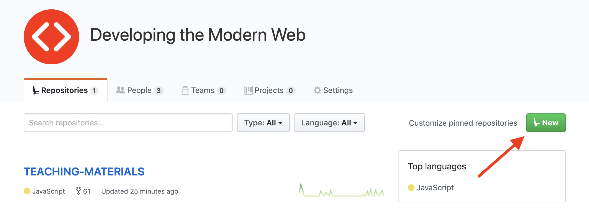
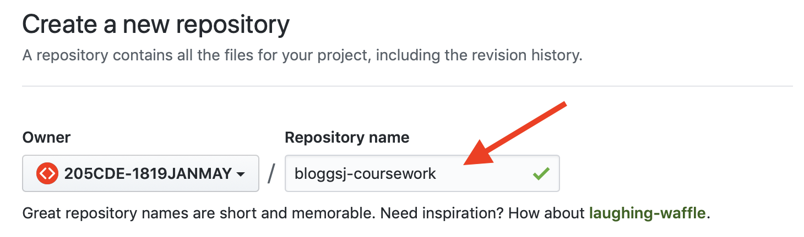
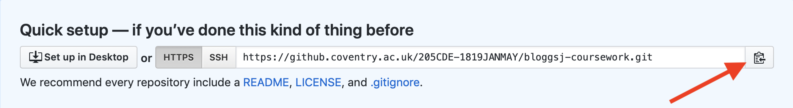
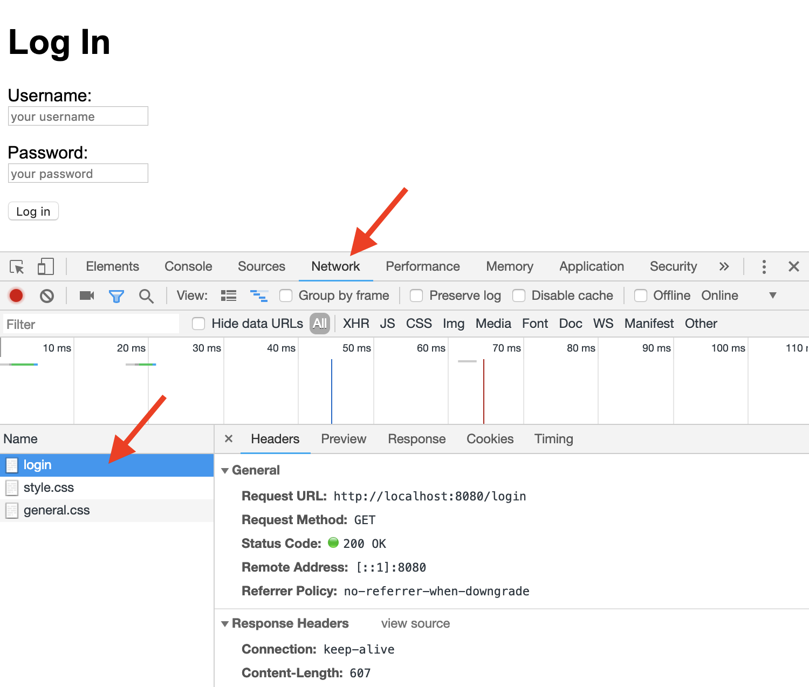

# Forms and Authentication

In this worksheet you will be learning how to build valid html5 forms and how these can be used to build secure dynamic websites. By the end of this you will have a basic functioning secure website that you can use as the basis of your coursework assignment. As such the first tasks will be to create a repository for your assignment code and clone this to your online IDE or local workstation.

## Resources

1. [Lecture slides](https://docs.google.com/presentation/d/105h61SpfKCpyb1NTzNQtzUJmQDOvyGa4tkcQwQdAmhU/edit?usp=sharing)

## 1. Configuring the Repository

Start by loading the [205CDE-1819JANMAY](https://github.coventry.ac.uk/205CDE-1819JANMAY) organisation page on the University GitHub server, note that this is where you can find the upstream teaching materials repository.

You should see a screen similar to this one.



### 1.1 Creating a Remote Repository

Click on the green button as shown to create a new repository. The name of the repository should comprise your username, a dash then the word coursework. Notice that the owner dropdown should be set to 205CDE-1819JANMAY.

Make sure you make the repository PRIVATE so that no-one else can access your work!:



### 1.2 Cloning the Repository

Now you need to clone this empty repository into either your online IDE or local computer. Navigate to the directory where you want to clone it. On an IDE such as gormio you should be cloning it in the top level `205CDE/` directory so it sits in the same place as the `labs/` repository. If you are at all uncertain, ask the lab supervisor before cloning.

The URL we need can be found on your new repository's home page.



Click on the small clipboard icon as shown to copy the URL to the clipboard.

We want to clone the repository into a directory called `coursework/` so we need to run the command:

`git clone https://your_repository_url.git coursework`

Make sure you use the URL of your own repository, you should be able to paste this either by right-clicking or `shift+ctrl+v`.

You should now have a new, empty* directory called `coursework`. Its not really empty of course as it contains the hidden repository directory, `.git`.

You should carry out all your work for the assignment in this directory.

#### 1.3 Configuring Git

Before you carry out any work on your assignment it is vital that you configure your repository correctly. Start by using terminal / git bash to navigate inside your project directory. Next you need to run the following commands, substituting your own name as it appears on your ID card and your correct university email address.

Follow the instructions below:

1. Update your name (this must be the name as it appears on your ID badge) using `git config user.name 'Joe Bloggs'`.
2. Update your email (using your unversity email) `git config user.email 'bloggsj@uni.coventry.ac.uk'`
3. Update your commandline editor choice using `git config core.editor nano` (the editor must be installed!)
4. Cache your credential (username/password) for an hour using `git config credential.helper 'cache --timeout=3600'`
5. Update the path to your _git hooks_ directory using `git config core.hooksPath ./.githooks` (more on this in a later lab).


### 1.4 Your First Commit

Every time you complete some meaningful work you should get into the habit of committing your changes. In this first commit we will create a **README** file that describes your project.

Start by creating a new file in your `coursework` directory called `README.md`. Locate the description for the assignment you have been assigned (based on your lastname), copy the entire block of text (including the numbered list) and paste it into the new file.

Now use your knowledge of the [markdown syntax](https://www.markdownguide.org/basic-syntax/) to format the page and make it readable. Save your work...

Now we can run a status check on your repository by running the `git status` command. Notice that it has detected that you have added a file (it is currently untracked by git).

Now we need to stage the file ready for it to be committed.

```
$ git add README.md
```

A further status check should indicate that the file is staged and ready to be committed. To commit this work:

```
$ git commit -m 'created a readme file'
```

### 1.5 Pushing to the Remote Repository

We now have our first commit but, if you refresh the GitHub page this is only done locally. The final step is to push our new commit up to the GitHub server. You can confirm this by running another status check.

To push the commit to github you need to run:

```
git push origin master
```

You will be prompted for your username and password.

Once this is completed you should be able to see the commit on GitHub (you may need to refresh the web page).

For the rest of this lab you should be working in your new repository, moving files from the lab as needed.

### 1.6 Test Your Understanding

1. Locate the `labs/exercises/07_forms_auth/` directory and make copies of the `index.js` and `package.json` file in your new `coursework/` directory.
2. Use the `npm install` command to install the required packages.
3. Check the repository status, note that it has detected the `node_modules/` directory, we don't want to add any of these files to our repository.
4. Create a new file called `.gitignore` (remember to start with the full stop!).
5. Add the line `node_modules/` to this file and save the changes.
6. Check the repository status, notice that it now ignores the `node_modules/` directory.
7. Make copies of the rest of the files and folders that are in the `07_forms_auth/` directory.
8. Check the repository status, notice that the database is being detected by git, we don't want this included in the repository!
9. Add the line `*.db` to the `.gitignore` file, this should prevent any database being added to any commit.
10. Stage and commit your changes.
11. Push the new commit to your GitHub repository.

## 2 Form Processing

Before we carry out any more tasks we should check that our copy of the web server works correctly. Start the server and navigate to the base url. You should see a message requesting you to log in.

If you examine the URL you will see that this has changed to:

```
/login?msg=you%20need%20to%20log%20in
```

Because you are not logged in, the server is redirecting the browser to the login page.

There are two forms (login and register) and each has a POST route to process the data. At the end of each of the POST scripts the browser will be redirected to the appropriate page.

Now try accessing the `/register` route, this should display a registration form where a site visitor can create an account. Try creating an account then returning to the home screen and logging in.

Before attempting the exercises below, make sure you read through the JavaScript code in the `index.js` file and that you understand the html in the file in the `views/` directory.

### 2.1 Test Your Understanding

1. Create a link on the log in screen to take the user to the registration screen and a link there to take the user back to the log in screen.
2. Create a **Log Out** link on the homepage. If a user clicks on this it should take them to the `/logout` route which will log them out.
3. Currently all uploaded files are saved as `avatar.png` in the `public/avatars/` directory which means when a new user creates their account the avatar will overwrite the previous one. Modify the code so that the name of the avatar matches the username. How will you decide what file extension to use?
4. The registration form should only allow each username to be assigned once. Modify the script so that if a new user chooses a username that is already in use they should be prompted to choose another one. The form should display the message **Username already in use**.
5. The registration code allows a user to create an account with a blank username and/or password. Modify the code to prevent this. The form should be displayed with a message informing the user which field needs correcting. Make sure you pass the form data back to the form and display this.
6. The server throws an error if the user fails to choose a profile picture. This should be optional so fix the code so that the error is not thrown.
7. When logging in, if the password field is left blank the user is automatically allowed to log in! Improve the security by checking the password field and, if it is blank, redirecting the user back to the login screen displaying a the message **Invalid Password**.

## 3 HTML5 Forms

The website currently has two forms, one handles user registration and the other logging in. Both send their data using the POST method which means the server must provide POST routes to process the data. If you examine the registration form you will see that there is an `enctype` attribute. This stands for _encoding type_. The enctype attribute specifies how the form-data should be encoded when submitting it to the server. In this form it is set to `multipart/form-data`. This value is required when you are using forms that have a file upload control.

### 3.1 Test Your Understanding

1. The forms are not using valid html5 labels. Fix this and use the HTML5 validator to check the job has been done correctly.
2. It would be useful to ask for the user's actual name. Modify the form to request this and change the back-end database and code to ensure this is stored.
3. We want to know which country the user is from and store this as a two digit country code such as `GB`. Create a dropdown list using the [`select`](https://developer.mozilla.org/en-US/docs/Web/HTML/Element/select) element which will allow the user to choose their country name, use the data in the `countries.json` file and import this using the `fs.readfile()` function which returns a promise. Make sure you update the database schema to include this additional field.
4. A user should be able to view and change their profile information. Create a new page based on a new template called `profile.handlebars`. This should populate a form with the user information and, if the user changes this and clicks on an **Update** button should update their record in the database. There should be a link to this on the homepage.

## 4 Authentication and Authorisation

When you build a dynamic website there is a requirement for users to be able to access online resources in a controlled manner. We need to consider:

1. Authentication: can a user get access to the site (log in).
2. Authorisation: when they are logged in, what access rights will a user have.

Because http is stateless, it has no way to remember whether someone is logged in or not and what permissions they have. To solve this problem, a web server can send some data to be stored in the web browser, these are known as cookies.

All cookies are encrypted and only available to the website that created them. Every time a user makes a request to the site they are sent in the HTTP headers. The server can also delete any cookies is has created.

In this website we are using cookies to flag whether a user is logged in. The home page is secure, it checks for the presence of a suitable cookie and, if it does not find one it redirects the user to the log in page. You can see this on line 37. The login page checks the username and password and, if they match creates a cookie called `authorised` and setits value to `true` (line 94).

If the cookie is found and set to true we know they have already logged in and can provide access to the secured section of the site. When the user clicks on the log out button we simply delete the cookie (line 102) and send them to the home page.

Start the web server and open the homepage in the Chrome browser. Open the developer tools, select the **Network** tab and refresh the page. Select the html page as shown and study the request headers, notice that there is no cookie.



If you now log in you will be directed back to the homepage. If you study the request headers you will see it now includes a cookie. This contains a hash that contains all the data we have stored. It is created by the following steps:

session data is encoded into JSON, then into base64, then attached to a cookie. Locate this string which looks something like this, the second line shows the data part:

```
koa:sess=eyJhdXRob3Jpc2VkIjp0cnVlLCJfZXhwaXJlIjoxNTUxNzMyODA5NjU1LCJfbWF4QWdlIjo4NjQwMDAwMH0=
eyJhdXRob3Jpc2VkIjp0cnVlLCJfZXhwaXJlIjoxNTUxNzMyODA5NjU1LCJfbWF4QWdlIjo4NjQwMDAwMH0=
```

Now copy the base64 encoded string and paste it into a website that can decode base64 data. You will end up with something like this:

```
{"authorised":true,"_expire":1551732809655,"_maxAge":86400000}
```

As you can see, the value we set is directly stored in the cookie. As you are now probably aware, cookies are not the most secure way to store session data!

So how can we improve this security? The simplest way is to use xxx encryption on the data. Luckily there is a module called [koa-encrypted-session](https://www.npmjs.com/package/koa-encrypted-session) that makes it easy to implement. It is recommended that you use the unencrypted sessions to help debug your code but switch to an encrypted cookie on the production server.

### 4.1 Test Your Understanding

In this section we will be implementing more granular authorisation by creating an admin-only area on the website:

1. Add an extra boolean field to the database called `admin` with a default value of `false`.
2. Manually modify one of your registered accounts and change the stored value to `true`, this will be your admin user.
3. When a user logs in, check this field and, if it is set to true, create a new session variable called `admin` and assign it a value of `true`.
4. Create a new admin page, `admin.handlebars` and make sure it is protected in the same way as the home page.
5. Create a link to this new page from the homepage.
6. Modify the page so that, if the user does not have admin authorisation they get redirected back to the home page which should display a message **You do not have admin privileges!**.

## 5 Extension Tasks

Congratulations, you now have a working secure website shell which can be used as the base code for your coursework. You should now consider the following:

1. Start by encrypting your cookies using an appropriate npm package.
2. The website is currently using a relational database (SQLite). If you plan on using a different form of persistence such as a document database (eg MongoDB) or a graph database (eg Neo4J) this is the time to make the change. Make sure the existing functionality works with your chosen persistence technology.
3. In your last lab you learned how to build list and details pages and connect these together. Read your assignment brief carefully and decide if and how you will implement these. You should start work on this part of your project at the earliest opportunity.
4. You will need to implement one or more forms as part of your assignment. Analyse the problem and build template files containing your required forms. Also implement the code required to process this data and add it to your preferred database.

## Advanced Topics

There are a number of advanced topics on the subject of authentication and authorisation. You may wish to consider:

1. [Sending emails using NodeJS](https://codeburst.io/implementing-nodemailer-5-min-de2d2c781d6b)
2. [Account verification](https://stackoverflow.com/questions/39092822/how-to-do-confirm-email-address-with-express-node)
3. [Password reset](http://sahatyalkabov.com/how-to-implement-password-reset-in-nodejs/)
