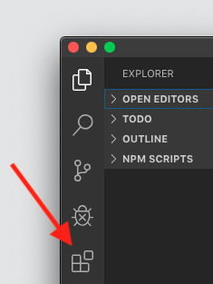
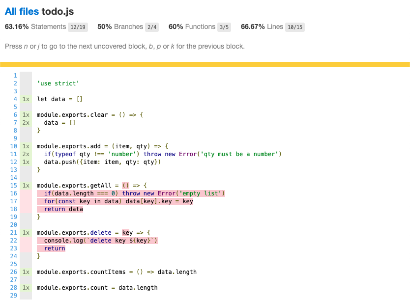

# Automated Testing

In this worksheet you will learn the basics of using automated tests to improve the quality of your code.

Before you start you need to pull any _upstream changes_. Detailed instructions can be found in the **Setup** lab.

We will be using both the Jest commandline tools and the integrated unit testing tools in Visual Studio Code, you should be familiar with both approaches.

## Visual Studio Code Extensions

One of the powerful features of VS Code is its support for **Extensions** which allow you to add additional capabilities to the editor.



You should start by opening the tab and checking for the extensions already installed, these will be listed in the **ENABLED** section. If any of these are not listed you can use the search box to search for them and then install. Once the extensions are installed you will need to shutdown and reload VS Code for them to take effect.

In this lab you will need:

1. coverage-gutters
2. jest
3. test-explorer

## Opening the Project

In the previous labs you have opened the `foundation` directory in VS Code and hd access to all the files and subfolders. The testing tools require you to open the folder containing the project we want to test directly so you will need to use the file menu and open the `foundation/exercises/07_unit_testing/todo/` directory.

The project has a number of node package dependencies which are listed in the `package.json` file. Start by installing all of these and then you should start the server and have a look at the website. As you can see it is a simple todo list, try adding a few items and deleting them, you will see that only some of the functionality has been implemented!

## Understanding the File Structure

If you have opened the correct directory in VS Code you should see these files in the file explorer:

```
.
├── index.js
├── jest-test.config.js
├── modules
│   └── todo.js
├── package.json
├── public
│   └── style.css
├── readme.md
├── unit tests
│   └── todo.spec.js
└── views
    ├── empty.hbs
    └── home.hbs
```

By now you are familiar with most of these however there are a couple of files you may not be familar with:

1. The `jest-test.config.js` file contains the settings used by the **Jest** testing tool.
1. The `modules/` directory contains the code providing the logic for our app (the _Model_ in the _MVC_).
2. The `unit tests/` directory contains our test _fixtures_ (the code containing the tests to run). There should be one test file for each file we want to test, the naming covention is that it should match the name of the file to test with `spec` between the name and extension.

## Running the Tests From the CLI

We will start by running the tests from the shell. Open the integrated terminal and run the command:

```shell
$ npm run test

  > todo@1.0.0 test /Users/marktyers/Documents/foundation/exercises/07_unit_testing/todo
  > jest --coverage --runInBand

  PASS  unit tests/todo.spec.js
    add()
      ✓ add a single item (4ms)
      ✓ qty must be a number (1ms)

  ----------|----------|----------|----------|----------|-------------------|
  File      |  % Stmts | % Branch |  % Funcs |  % Lines | Uncovered Line #s |
  ----------|----------|----------|----------|----------|-------------------|
  All files |    63.16 |       50 |       60 |    66.67 |                   |
   todo.js  |    63.16 |       50 |       60 |    66.67 |    16,17,18,22,23 |
  ----------|----------|----------|----------|----------|-------------------|
  Test Suites: 1 passed, 1 total
  Tests:       2 passed, 2 total
  Snapshots:   0 total
  Time:        1.208s
  Ran all test suites.
```

As you can see from the output it has found and run two tests on the `add()` function with both tests passing.

The table provides a code coverage report that shows you how much of your code is covered by the existing tests. If these are less than 100% there are gaps in your testing however just because you have 100% coverage does not mean you have tested all eventualities!

For more details of your code coverage you need to view a detailed report. The testing tool has created a new `coverage/` directory which contains the following:

```
.
├── clover.xml
├── coverage-final.json
├── lcov-report
│   ├── base.css
│   ├── block-navigation.js
│   ├── index.html
│   ├── prettify.css
│   ├── prettify.js
│   ├── sort-arrow-sprite.png
│   ├── sorter.js
│   └── todo.js.html
└── lcov.info
```

Locate the `index.html` file in the **Explorer** tab, right-click on this and choose  Right-click on the `index.html` file and choose **Reveal in Finder** or equivalent. When this is done you can open the file in the Chrome Browser where you will see:


This lists the code coverage for all the files you are testing. If you click on a filename you will see details of precisely which lines of code are being tested and which lines are not covered by your tests:



Any code highlighted in red is not covered by your test suite.
