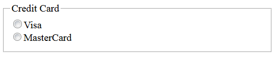
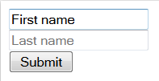
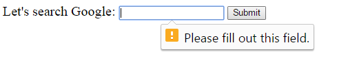

# Forms

In this final part of the worksheet you will be building forms that can send data to a web server.

### 5.1 POST vs GET

Lets start by looking at how forms send data to the server. This can be done using the HTTP `GET` method or using the `POST` method. Lets try out both so we can understand the differences.

#### 5.1.1 Submitting Data Using POST

Make sure the web server is running and access the `/postform` route and open the corresponding html file.

1. Complete the form with your name.
2. Click on the the **Submit** button.
3. Examine the URL carefully:
    1. Notice that it points to the base route `/` with no additional data in the URL.
4. Open the _Chrome developer tools_ and look at the _http request_:
    1. Notice that the request uses the `POST` method. This corresponds to the `method` attribute in the `<form>` element.
    2. The request header includes a `Content-Type` header which contains the value `application/x-www-form-urlencoded`.
5. There is a _request body_ which contains the form data:
    1. This uses the `application/x-www-form-urlencoded` encoding.
    2. Notice that it contains 2 query parameters in a querystring.
    3. The names of the query parameters correspond to the values in the `name` attributes in the `<input>` elements.

#### 5.1.2 Submitting Data Using GET

Make sure the web server us running and access the `/getform` route and open the corresponding html file.

1. Complete the form with your name.
2. Click on the the **Submit** button.
3. Examine the URL carefully:
    1. Notice that it contains 2 query parameters in a querystring.
    2. The names of the query parameters correspond to the values in the `name` attributes in the `<input>` elements.
4. Open the _Chrome developer tools_ and look at the _http request_:
    1. Notice that the request uses the `GET` method. This corresponds to the `method` attribute in the `<form>` element.
    2. The URL contains the data (remember there is only a request _body_ when the `POST` method is used.

### 5.2 Form Controls

In the previous section the form used the `<input>` element which displayed simple text boxes where you could enter anything. In this section you are going to learn about how to use a wide range of different controls to capture user input.

#### 5.2.1 Input Elements

HTML defines a number of input types that can be used in forms. The commonly used ones are:

- Plain text: `<input type="text">`
- Password fields: `<input type="password">`
- Email addresses: `<input type="email">`

The above are supported by most browsers. There are some new input types also:

- URL addresses: `<input type="url">`
- Numeric data: `<input type="number">`
- Date pickers: `<input type="date">`

The main reason for introducing these new input types is for mobile devices with limited screen sizes where special keyboards/input methods can be used.  But note that not every browser supports the new types.

> Input types, not supported by old web browsers, will behave as input type text. See [here](http://www.w3schools.com/html/html_form_input_types.asp).


### Hidden parameters

Sometimes we need a way to submit some additional parameter to the server. This can be done by using a `hidden` input parameter.
A hidden parameter has no onscreen appearance, but it will be sent to the server.

```html
<form>
......
    <input type="hidden" name="org" value="Acme" />
    ....
</form>
```

#### 5.2.2 Lists

The problem with the `<input>` elements is that it forces users to input _free text_ which means the data will require a lot of validation. For example if asked to input a city users might enter `Coventry`, `coventry`, `Cov`, `Coventry City` and any number of variations. Where possible you should require users to choose from a predefined list.

There are two ways to define a list, radio/checkboxes and dropdown lists. Load the `/lists` route in your browser to see these in use. Make sure the web server is running, access the `/lists` route and open the html file that is being displayed.

Whilst not strictly a list, **checkboxes** can be used where the user can pick one or more options from a short list.

```html
<input type="checkbox" name="foo" value="1">Option 1<br/>
<input type="checkbox" name="bar" value="2">Option 2<br/>
```

Notice:

1. It uses the standard `<input>` element.
2. The `type` attribute has a value of `checkbox`.
3. Each has a _different_ value for their `name` attribute.
4. The `value` atribute contains the value that is passed to the server.

Radio buttons are to allow the user to make a selection from a small number of options:

```html
<input type="radio" name="foobar" value="1">Option 1<br/>
<input type="radio" name="foobar" value="2">Option 2<br/>
```

Notice:

1. It uses the standard `<input>` element.
2. The `type` attribute has a value of `radio`.
3. All grouped options must have the same value for their `name` attribute.
4. The `value` atribute is what is passed to the server.

The `select` element defines a drop-down list, and the `option` element is used to define a list item.

```html
<select name="example">
  <option value="notknown">Not selected</option>
  <option value="item1">Item 1</option>
</select>
```

Every `option` element should have a unique value, just like in checkboxes and radio buttons.

#### 5.2.3 Test Your Understanding

1. Create a new route in the `index.js` file called `/register`.
2. Create an html file called `registerform.html`.
3. Create an html form that `POST`s its data to `/`.
4. Create a registration form using all of the different form controls you have seen.
5. Make sure you understand the data displayed when the form is posted.
6. Change the form so it makes a `GET` request.

### 5.3 Labelling Forms

`<label>` elements are used to connect texts and controls that are used together in forms. For example radio buttons and check boxes often come with preceding texts that describe the choice. However if the user clicks the text nothing happens. That's because the browser doesn't know the connection between the text and the neighboring control. They must be wrapped up with label element.

```html
<form action="">
<input type="checkbox" name="bike" value="Bike">I have a bike<br>
<input type="checkbox" name="car" value="Car">I have a car
</form>
```

You have to click on the box. But if you have

```html
<form action="">
<label><input type="checkbox" name="bike" value="Bike">I have a bike</label><br>
<label><input type="checkbox" name="car" value="Car">I have a car </label>
</form>
```

It is enough to click on text too.

Note the above can also be written as the following, which is also valid but needs more typing

```html
<form action="">
<input type="checkbox" name="bike" id="bike" value="Bike"><label for="bike">I have a bike</label><br>
<input type="checkbox" name="car" id="car" value="Car"><label for="car">I have a car </label>
</form>
```

> Read discussions on [StackOverFlow](http://stackoverflow.com/questions/774054/should-i-put-input-tag-inside-label-tag) for different ways of associating labels and inputs.

### Use grouping and hints

In many user interfaces, you can see how different elements on the screen are grouped together in order to make the input easier for the user. In HTML, you can use `fieldset` element for this.

```html
<form action="">
<fieldset>
<legend>Credit Card</legend>
<label><input type="radio" name="card" value="Visa">Visa</label><br>
<label><input type="radio" name="card" value="MCard">MasterCard </label>
</fieldset>
</form>
```

What you get is



In user interfaces it also a common practice to give hints on the kind of data is expected. In HTML, this can be achieved by `value` or `placeholder` attribute on the controls. The `placeholder` attribute's text disappears once the control is clicked in or gains focus and the `value` attribute's text stays in place when a control has focus unless a user manually deletes it.



#### 5.3.1 Test Your Understanding

Make sure the web server is running and access the `/semantic` route. Open the html file containing the form that is being diplayed.

1. At the moment, you have to click exactly the right spot on your checkboxes etc. Change this by using labels.
2. Rearrange your form with legends and fieldsets in order to make it easier for the user to understand.
3. Give input hints to the user whenever possible.

### 5.4 Form Validation

Form validation is traditionally done using JavaScript. But HTML5 introduces some new ways of doing it, which makes validation a lot easier.

#### 5.4.1 'required' attribute

Now return to the very first example in this lab

```html
<form action="http://www.google.com/search">
  <div>
    Let's search Google:
    <input name="q">
    <input type="submit">
  </div>
</form>
```

If we add a `required` attribute to the query input, it will become `<input required name="q">`. In this case, the query field is required. In other words, if we don't type in anything in this field, we'll have an error message when trying to click submit.

.

Behind the scene, the browser tries to verify user's input. There are some other input attributes that can serve for validation purposes. For example, `min` and `max` attributes for numerical input types such as `number` or `month`; `size` and `maxlength` for limiting the number of characters entered.

#### 5.4.2 'pattern' attribute based on regular expression

In addition to using different input types, we can also use patterns a.k.a.regular expressions. Using patterns, we can validate user inputs even more precisely.

Pattern is an encoded sequence of characters that define a pattern of text characters. Remember that client-side validation is not reliable as the only means of validation, it is useful to make the user interface more pleasant.

For example, a Finnish social security number (similar to UK National Insurance number) is often 999999-999X (for those who are born in the 20th century). The first 6 digits are the birth date: day, month and year's last two numbers. After "-" there are 3 digits and the last character can be either digit or letter from A to Y. If we want to make a pattern of this, it would be

```html
<input type="text" pattern="\d{6}\-\d{3}([0-9A-Y])" ...>
```

\d means a digit, \\- means the "-", [chars] means a set of characters.

### 5.4.3 Test your understanding

Open file **form-skel.html**. Validate the user's data in Student id, email address and score by using patterns.
