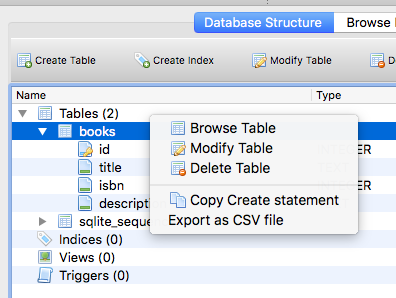

# Dynamic Websites

By this stage you are familiar with the NodeJS language and how the Express framework to deliver web pages. You have also been working with various types of data persistence such as SQLite databases. This worksheet will show you how to use this knowledge to design and build a dynamic website, that is a website that gets its content from a data source (such as a relational database).

## 1 Building SQLite Databases

In the data persistence worksheet you worked with scripts that created a new database on launch and added the tables dynamically. In a typical scenario you would want to create the database .db file and populate it with some data before running the script. Since an SQLite database is just a single binary file with a .db file extension this process is very straightforward and you can either use the commandline shell tool or choose from a number of graphical tools to make this step as easy as possible.

### 1.1 Using the Shell Tools

Start by installing the tools on your computer:

1. On MacOS, install the [Brew Package Manager](https://brew.sh/) then `$ brew install sqlite`.
2. On Ubuntu (including CodeAnywhere) it should be installed using the standard package manager:
    1. `$ sudo apt-get update`
    2. `$ sudo apt-get install sqlite3 libsqlite3-dev`
3. It a bit of a pain to install on Windows 10 but there is a good [YouTube video](https://youtu.be/zOJWL3oXDO8) that covers the process.

If you use the terminal/command prompt to navigate to the `exercises/13_website/bookshop/` directory you will find a prebuilt database called `bookshop.db`. To open a database you use the `sqlite3 bookshop.db` command. Note: if the file you specify does not exist, a new database will be created. Open the `bookshop.db` database.

Notice that the prompt changes to `sqlite>`, this means you are interacting with the `sqlite3` program. There are a number of special [commands](https://www.sqlite.org/cli.html) that include standard SQL statements as well as special sqlite commands (these start with a period/dot and are sometimes called _dotcommands_. Try the following commands (note: the up arrow recalls previous commands):

```sql
sqlite> .tables
sqlite> .schema books
sqlite> SELECT title, isbn FROM books;
sqlite> .headers on
sqlite> SELECT title, isbn FROM books;
sqlite> .mode column
sqlite> SELECT title, isbn FROM books;
sqlite> .exit
```

#### 1.1.1 Executing Complex SQL Commands

The sqlite shell works well for simple SQL statements but it is difficult to enter more complex ones. A better solution is to create a .sql file containing the commands you want to run and then importing it. There is a books.sql file in the same directory as the database. If you open this you will see an SQL INSERT statement that will add a new book to the database:

```sql
$ sqlite3 bookshop.db
sqlite> .read books.sql
sqlite> .headers on
sqlite> .mode column
sqlite> SELECT title, isbn FROM books;
sqlite> SELECT count(id) AS books FROM books;
sqlite> .exit
```

#### 1.1.2 Test Your Understanding

1. Edit the `books.sql` file so it contains 3 INSERT statements to insert an additional 2 books into the database.
2. Run this SQL on your `bookshop.db` database to insert the two book records.
3. Check that there are now 14 books in the database.

### 1.2 Using a Graphical Tool

As you have seen it is possible to work with an SQLite database using the CLI however it is not simple and straightforward, especially when inserting complex records. In this section we will be learning how to use a graphical tool called [DB Browser for SQLite](https://sqlitebrowser.org) which runs on MacOS, Linux and Windows. Note: since Codeanywhere does not suport a traditional X11 Windows GUI you won't be able to install it.

1. On MacOS and Windows 10 you can download the installer from the [main website](https://sqlitebrowser.org).
2. On Ubuntu Linux you need to [add an additional repository and install from there](https://linuxhint.com/install-sqlite-browser-ubuntu/):
    1. `sudo add-apt-repository ppa:linuxgndu/sqlitebrowser-testing`
    2. `sudo apt-get update`
    3. `sudo apt-get install sqlitebrowser`

Install and open the software then use the **Open Database** button in the toolbar to open the `bookshop.db` database.

#### 1.2.1 Modifying the Schema

Our first task is to add an author field to the database. Make sure the **Database Structure** tab is selected then right-click on the table name and choose **Modify Table**.



Use the **Add Field** button to add the `author` field which should have a type of `text`. 


Notice that it builds the correct SQL statement underneath. This is useful to learn how to use the SQL language. When you are done, click on the **OK** button.

#### 1.2.2 Browing and Editing the Data

Now we have modified the database schema we need to complete the task by adding the authors for the books in the table. You can find the list of authors in the `books.csv` file. Note: you have added two more books to the database so you will need to search for the authors data for these.

Open the **Browse Data** tab. Notice that there are two panes of information.

1. The left pane displays the records and fields currently in the selected table. You will have three additional records at this stage).
2. The right pane is for editing the currently selected database cell. if you make changes to a cell you should use the **Apply** button to save them.


Using the data in the `books.csv` file, add the authors to each of your book records.

#### 1.2.3 Test Your Understanding

1. Add two more fields to the database to store the _publisher_ and the _year_ the book was published. Make sure you choose the most appropriate data type for each.
2. Use the data in the `books.csv` file to insert the correct data. You will need to find this data for the three additional books you have added to the table.
